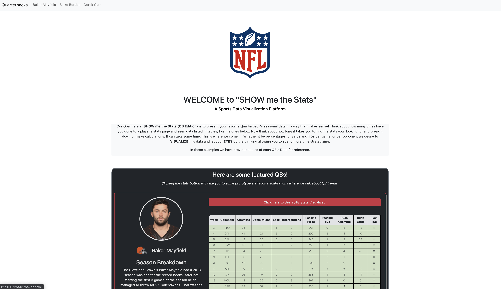

## Show Me the STATS

An interactive web application with which users can track NFL Qb data and performance over time.

[Live Application](https://cparros.github.io/football-visualization-project/)

## Questions that need answers...

### What is the problem I wannt to solve?

Sports Statistics Tables can be a pain to look over...so lets get rid of them with visualized data!

### What decisions need to be made?

### What JS libraries we can use to visualize data?
- Chart.js apex.js, morris, c3, D3!!
- Tableau for now to get idea of desired look. Tableau is good for prototypes but little customization. (Abstraction  Barrier)

### What is the desired outcome?

Create a tool/application that the user can access that will cut down on time spent combing statistics, and allow for more time to talk strategy and make decisions.

### What tasks should the user perform?

Search, Select athlete, select data they desire to see/access

## User Story

AS a coach I desire to scout my next opponent's starting quarterback.
I WANT a tool that makes data easy to view and interact with UNLIKE a stat table
SO THAT I can spend less time parsing data and more time actually strategizing. 

AS a sports fan I desire to look at data about many different starting quarterbacks.
I WANT an application I can use to quickly look over visualized statistics in order to pick the QB for my lineup/fantasy team.

## Future Developement

- Move JS to files
- create ALL charts with charts.js or D3 to allow customization (Abstraction Barrier)
- Mobile functionality
- User Selection/Imput to allow for dynamically created graphs
- More QBs
- More Interactive Charts
- Connection to a database
- Allow users to create a profile where they can save QB's they have researched and charts they have made

## Questions
Email: Celparros@gmail.com